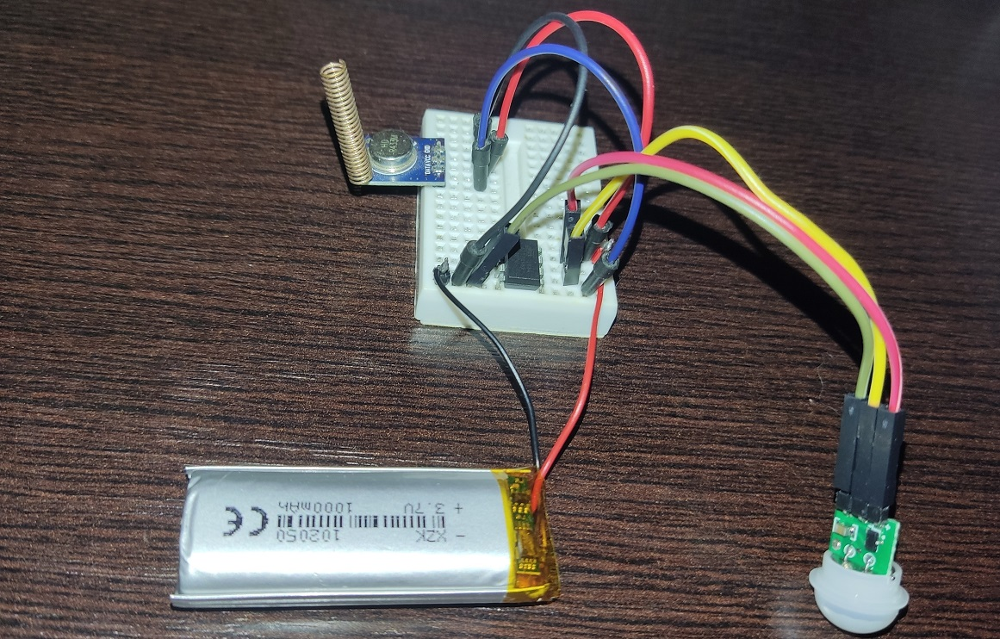

# SensorNodeESP

Data from sensor (PIR, CO2, smoke/water detectors...) is logged and sometimes sent to user (WhatsApp message, E-mail).

ATtiny sleeps, wakes up on HIGH (PIR...), sends signal via STX882, goes back to sleep. Device can be battery powered. 

## Sender: ATtiny85, STX882, PIR - test device

## Receiver: ESP8266, SRX882 - test device

## TODO

- [x] ATtiny sleep, wake up on button, PIR...
- [x] ATtiny sends signal via STX882, ESP8266 receives that signal
- [ ] Hub - central component: ESP (8266/32) receives and logs messages (source/sensor, type:info/warning/error/alarm..., message/data ...) and then sends WA message or e-mail.
    - [ ] Connect ESP from ESP_IR_TV project with another ESP8266 w/ SRX882 (server/receiver for radio signals). I2C?
- [ ] ESP8266 sending message via ESP Now or HTTP web request to another ESP (8266/32).
