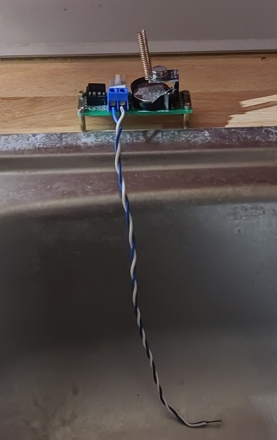

# SensorNodeESP

Data from sensor (PIR, CO2, smoke/water detectors...) is logged and sometimes sent to user (WhatsApp message, E-mail).

## Server (Hub): ESP32 (SRX882, buzzer)

## Web app - interface

## Client: ESP8266 & ENS160+AHT21
ESP wakes up every 10 minutes and sends data from sensors to the hub (server) via ESP-NOW.

## Client: ATtiny85 & STX882
ATtiny sleeps, wakes up on HIGH (test button, PIR, wires for water detection...), sends signal via STX882, goes back to sleep. Device can be battery powered.
### Movement detection

### Water detection

## TODO
- [ ] README.md: Change images where necessary.
- [ ] Hub:
    - [ ] See some examples of ESP32 code that deals with time (summer/winter daylight, update/refresh time)
- [ ] Add more sensor nodes
    - [ ] ATtiny & HC-12
        - [ ] Is ESP32 hub impaired by calling HC12.available()? Does it interfere with buzzer?
        - [ ] Remove ATtiny & STX882 from project if STX882 can't work precisely with ATtiny85 as with other microcontrollers
    - [ ] Microphone (noise levels)
- [ ] Improve web app interface (chart.js disapears, shrinks)
- [ ] Add 5V buzzer (with transistor)
- [ ] Check if it's possible for ESP8266 to get back a value from the hub (two-way communication) and then go to sleep.
    - [ ] If that's possible, write a code that returns how much (milli)seconds should client wait until next reporting to the hub.
    - [ ] Maybe the solution for precise reporting by clients it for client to sleep for e.g. 9 minutes, and then asks hub for current time and then sends data based on that time.

## Add new client routine
- my_esp_now.h: in setPeers() add new setPeer() call
    - setPeer(): set parameters: mac address, sensor type, device
- Increase length of peers array: peer_info peers[]
- Add new members to arrays: StrSensorTypes[], SensorTypesComment[]
- index.html:
    - CmbChartParamsChange(): adjusting chart for sensors with temp and hum
    - lastChartParam: add default property for new sensor
...

## Links

### ESP-NOW
- https://randomnerdtutorials.com/esp-now-two-way-communication-esp32/
- https://randomnerdtutorials.com/esp-now-two-way-communication-esp8266-nodemcu/
- https://randomnerdtutorials.com/esp-now-auto-pairing-esp32-esp8266/
- https://randomnerdtutorials.com/esp32-esp-now-wi-fi-web-server/
- https://rntlab.com/question/esp-now-gateway-wifi_mode_sta-with-a-wifi-router/
- https://forum.arduino.cc/t/use-esp-now-and-wifi-simultaneously-on-esp32/1034555/16

## Remarks
 - ESP-NOW communication works if WiFi channel on the router is set to 1. There might be ways to fix that by using wifi_promiscuous_enable()...

