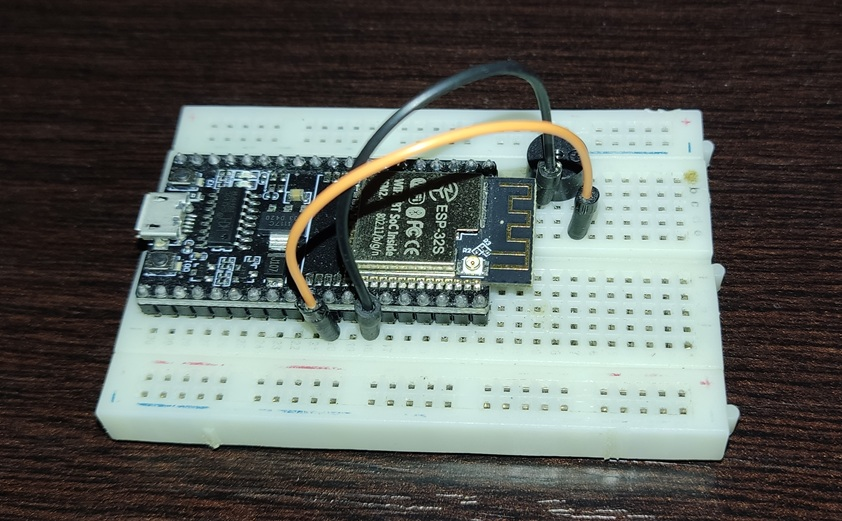
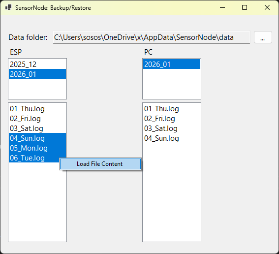
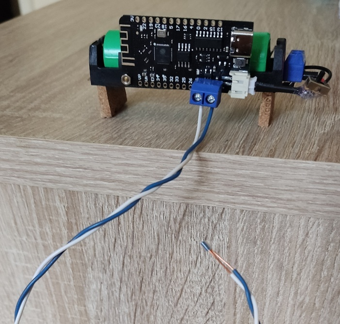

# SensorNodeESP

Data from sensor (PIR, CO2, smoke/water detectors...) is logged and sometimes sent to user (WhatsApp message, E-mail).

## Server (Hub): ESP32 w/ buzzer

## Web app - interface

## Windows desktop app: backup logs (data from sensors)

## Air Quality Data
ESP wakes up every 10 minutes and sends data from sensors to the hub (server) via ESP-NOW.

### SCD30 - CO2
...

### ENS160, DHT22 - air quality data

## Client: ESP32, Li-Ion 18650 battery, ESP-NOW
ESP32 device wakes on a pin event (e.g. wires are submerged, PIR signals HIGH...), sends an ESP-NOW message to a predefined MAC address (hub) and then goes back to deep sleep.
### Water detection

## TODO
- [ ] README.md:
    - [ ] (WIP) Add new images of the hub and clients
- [ ] Hub:
    - [x] Improve SimpleEvent handling in the loop() of main_hub.cpp. Handle ID of the message, log and send to WA message text, try to add more clients (diff devices, messages...)
    - [x] Improve (with logging number of repeated messages) a mechanisam (class or a function) that will prevent hub from accepting repeated messages from clients: batches of messages from the same client caused by failed logic in retrying (this should be logged as an error).
    - [ ] Make 2nd version of Hub project - Hub /wo internet for places without internet access or with unknown net credentials. Communication with clients is done via ESP-NOW or radio (HC-12, LoRa...). Maybe it could have its own wireless network for web app access?
        - [ ] Test if it's possible for 2 ESP32's to communicate /wo (known) WiFi network. If it's possible, create project with 2 simple parts: client (reacts on some simple event e.g. PIR) and server (beeps when ESP-NOW msg from client is received)
    - [ ] Web App:
        - [ ] Improve interface (chart.js disappears, shrinks)
    - [ ] Add 5V buzzer (with transistor) for louder sound notifications
- [ ] Clients:
    - [ ] (WIP) SCD30:
        - [ ] Save to log file any indication of an error. Make sure it can be read easily.
            - [ ] Try to solve logged issues by retrying functions that failed. If there is no logged issues and there is still missing data - maybe it's because of the power supply (not enough current).
        - [ ] Try to use TimeSlotSend class
        - [ ] Add an image of the device and a README.md file to the project.
    - [ ] esp32-wake-on-pin
        - [ ] Test this code with ESP32-C6 SuperMini when it arrives
    - [ ] Add more sensor nodes
        - [ ] Microphone (noise levels)

## Add new client routine
- my_esp_now.h:
    - setPeers(): add new setPeer() call
        - setPeer(): set parameters: mac address, sensor type, device
    - Increase length of peers array: peer_info peers[]
    - Add new members to arrays: StrSensorTypes[], SensorTypesComment[]
    - OnDataRecv(): if (p->type == SensorType::...)
- Enums.h: Add new members to SensorType, Device
- index.html:
    - CmbChartParamsChange(): adjusting chart for sensors with temp and hum
    - lastChartParam: add default property for new sensor

## Links

### ESP-NOW
- https://randomnerdtutorials.com/esp-now-two-way-communication-esp32/
- https://randomnerdtutorials.com/esp-now-two-way-communication-esp8266-nodemcu/
- https://randomnerdtutorials.com/esp-now-auto-pairing-esp32-esp8266/
- https://randomnerdtutorials.com/esp32-esp-now-wi-fi-web-server/
- https://rntlab.com/question/esp-now-gateway-wifi_mode_sta-with-a-wifi-router/
- https://forum.arduino.cc/t/use-esp-now-and-wifi-simultaneously-on-esp32/1034555/16

## Remarks
 - ESP-NOW communication works if WiFi channel on the router is set to 1. There might be ways to fix that by using wifi_promiscuous_enable()...

