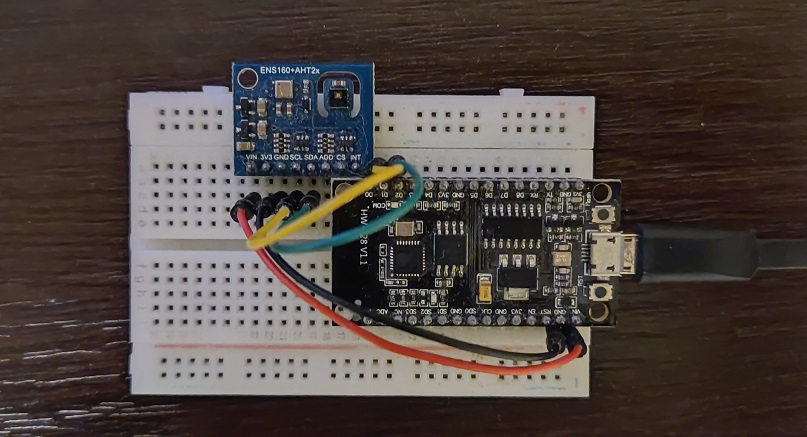
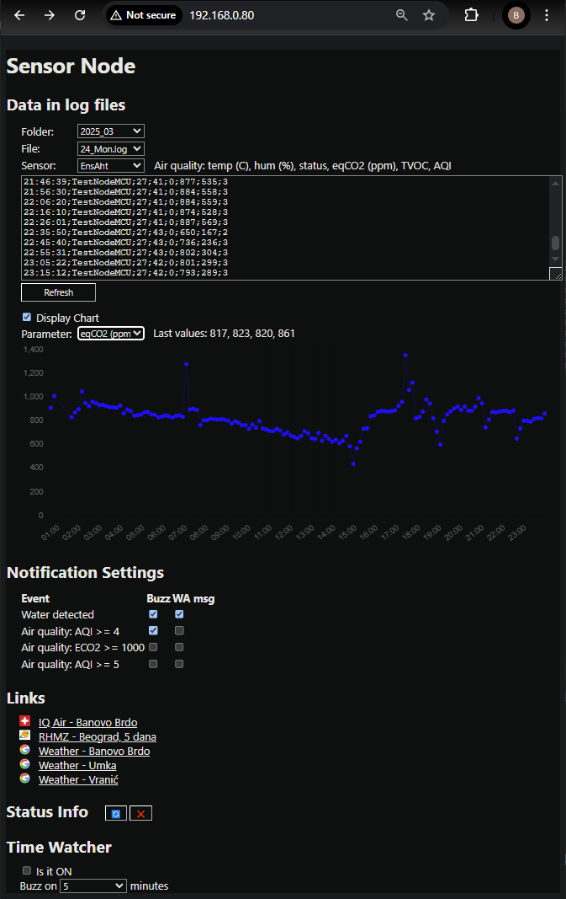

# SensorNodeESP

Data from sensor (PIR, CO2, smoke/water detectors...) is logged and sometimes sent to user (WhatsApp message, E-mail).

## Client: ESP8266 & ENS160+AHT21
ESP wakes up every 10 minutes and sends data from sensors to the hub (server) via ESP-NOW.

## Client: ATtiny85 & STX882
ATtiny sleeps, wakes up on HIGH (test button, PIR, wires for water detection...), sends signal via STX882, goes back to sleep. Device can be battery powered.

## Server: ESP32 (SRX882, buzzer)

## Web app - interface

## TODO

- [ ] Add notification control (when to send WA message, beep etc) to web app
- [ ] Add PlannedOutagesChecker to the project
- [ ] Add data visualization using some JS library

## Links
https://randomnerdtutorials.com/esp-now-two-way-communication-esp32/
https://randomnerdtutorials.com/esp-now-two-way-communication-esp8266-nodemcu/
https://randomnerdtutorials.com/esp-now-auto-pairing-esp32-esp8266/
https://randomnerdtutorials.com/esp32-esp-now-wi-fi-web-server/
https://rntlab.com/question/esp-now-gateway-wifi_mode_sta-with-a-wifi-router/
https://forum.arduino.cc/t/use-esp-now-and-wifi-simultaneously-on-esp32/1034555/16

## Remarks
 - ESP-NOW communication works if WiFi channel on the router is set to 1. There might be ways to fix that by using wifi_promiscuous_enable()...

