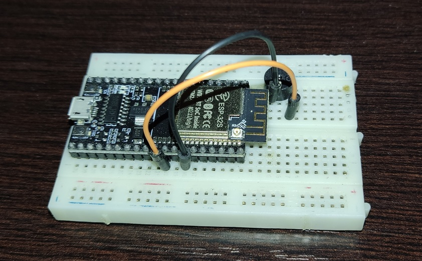
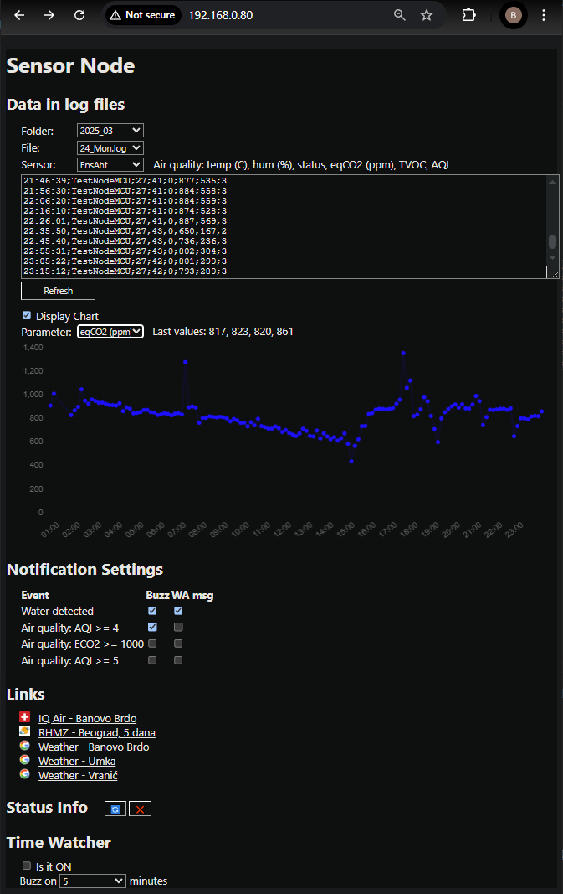
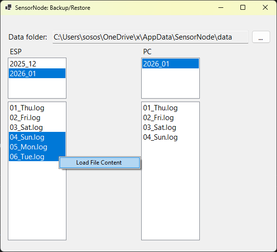
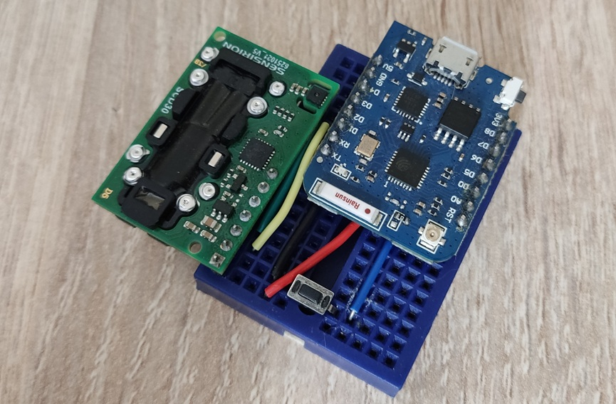
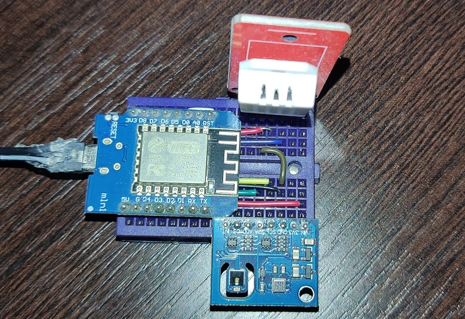
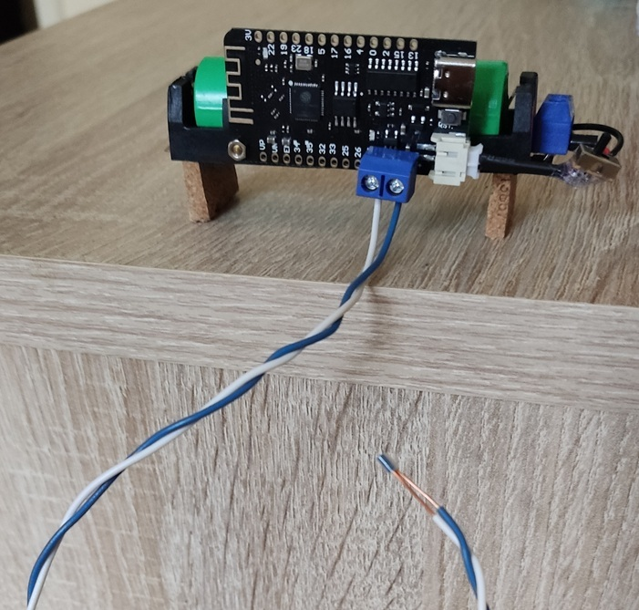

# SensorNodeESP

Data from sensor (PIR, CO2, smoke/water detectors...) is logged and sometimes sent to user (WhatsApp message, E-mail).

## Server (Hub): ESP32 w/ buzzer

## Web app - interface

## Windows desktop app: backup logs (data from sensors)

## Air Quality Data
ESP wakes up every 10 minutes and sends data from sensors to the hub (server) via ESP-NOW.

### SCD30 - CO2

### ENS160, DHT22 - air quality data (temp, hum, TVOC)

## Client: ESP32, Li-Ion 18650 battery, ESP-NOW
ESP32 device wakes on a pin event (e.g. wires are submerged, PIR signals HIGH...), sends an ESP-NOW message to a predefined MAC address (hub) and then goes back to deep sleep.
### Water detection

## TODO
- [ ] Hub:
    - [ ] (TEST) Does millis command returns ulong millis() on hub/server? Use retrying_retryer.cpp
    - [ ] Make 2nd version of Hub project - Hub /wo internet for places without internet access or with unknown net credentials. Communication with clients is done via ESP-NOW or radio (HC-12, LoRa, http...). Maybe it could have its own wireless network for web app access?
    - [ ] Web App:
        - [ ] Improve interface (chart.js disappears, shrinks)
- [ ] Clients:
    - [ ] ClientLogger
        - [ ] Use it in SCD30 and ENS&DHT projects
    - [ ] (WIP) Put retrying logic in a class: Retryer
    - [ ] TimeSlotSend
        - [ ] Change getDeepSleepTime() so that it takes into account wake time and time spent in sending data
    - [ ] (OPT) Put TSS, LoggerMin and retrying logic in a class that will be used by most clients that report data regularly to the hub
    - [ ] (WIP) SCD30:
        - [ ] Button click: print log on Serial and send data (prev data or wait for new?) to the hub
    - [ ] esp32-wake-on-pin
        - [ ] Test this code with SuperMini modules (C3, C6, S3)
    - [ ] Add more sensor nodes
        - [ ] Microphone (noise levels)

## Add new client routine
- my_esp_now.h:
    - setPeers(): add new setPeer() call
        - setPeer(): set parameters: mac address, sensor type, device
    - Increase length of peers array: peer_info peers[]
    - OnDataRecv(): if (p->type == SensorType::...)
- lib/Common/src/ToString.cpp:
    - Add new members to arrays: StrSensorTypes[], SensorTypesComment[]
- Enums.h: Add new members to SensorType, Device
- index.html:
    - CmbChartParamsChange(): adjusting chart for sensors with temp and hum
    - lastChartParam: add default property for new sensor

## Links

### ESP-NOW
- https://randomnerdtutorials.com/esp-now-two-way-communication-esp32/
- https://randomnerdtutorials.com/esp-now-two-way-communication-esp8266-nodemcu/
- https://randomnerdtutorials.com/esp-now-auto-pairing-esp32-esp8266/
- https://randomnerdtutorials.com/esp32-esp-now-wi-fi-web-server/
- https://rntlab.com/question/esp-now-gateway-wifi_mode_sta-with-a-wifi-router/
- https://forum.arduino.cc/t/use-esp-now-and-wifi-simultaneously-on-esp32/1034555/16

## Remarks
 - ESP-NOW communication works if WiFi channel on the router is set to 1. There might be ways to fix that by using wifi_promiscuous_enable()...

