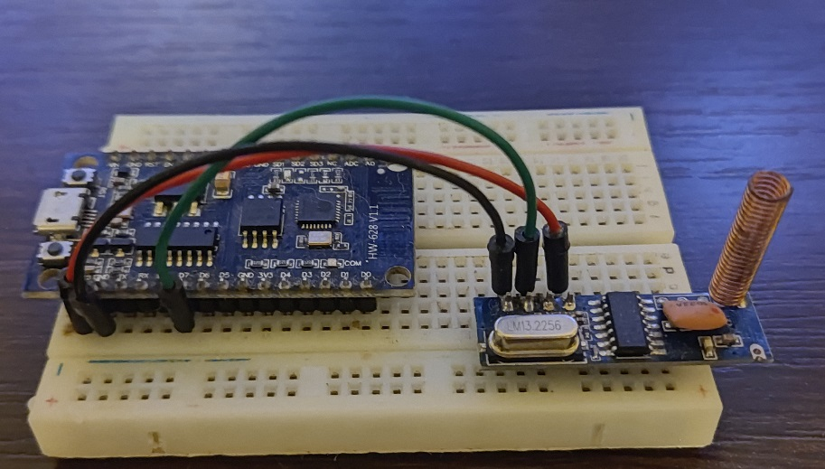

# ATtiny85 & STX882 -> ESP8266/ESP32 & SRX882

ATtiny sleeps, wakes up on HIGH (PIR...), sends signal via STX882, goes back to sleep. Device can be battery powered. 

## Sender: ATtiny85, STX882, PIR - test device

## Receiver: ESP8266, SRX882 - test device
