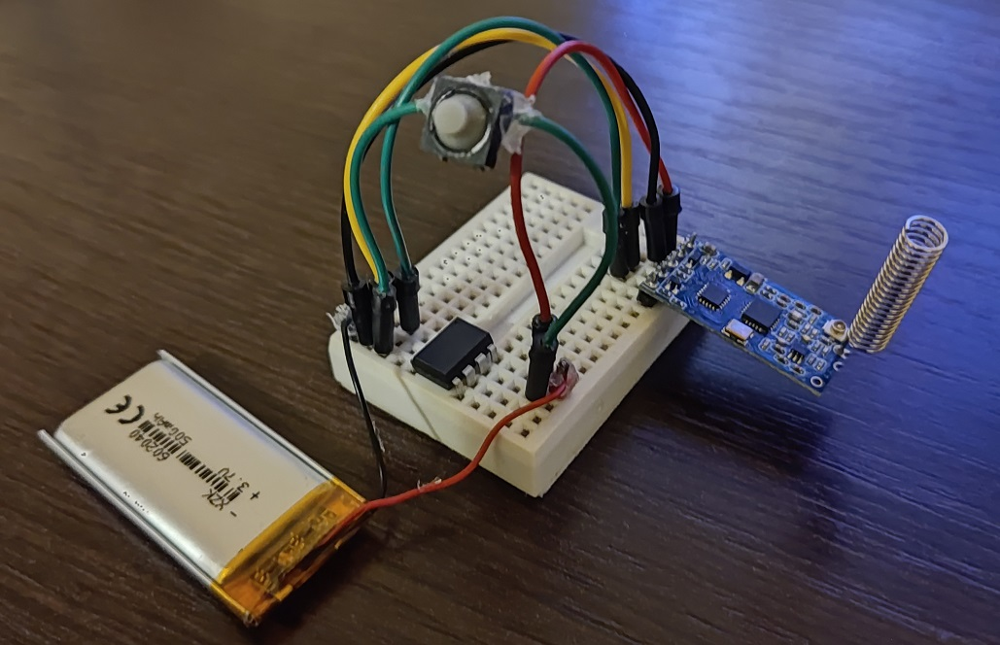

# Client Node: ATtiny85 & HC-12 as a transmitter

Low power client that sends short strings on an event: water detection, movement detection (PIR)...

## Test device

## TODO
- [ ] Can ESP32 hub receive this client messages?
- [ ] Try to improve attiny_sender_sleep_chatgpt_and_me.cpp:
    - [ ] Why does current consumption fluctuates from 0.01mA to 0.2mA (~3sec period)?
    - [ ] Is it possible to put HC-12 in a sleep mode with AT command and wake it up when it's needed?
- [ ] What fields should sent string contain: device ID (string), [alert ID so that main hub knows if it's the same alert that is reported e.g. 3 times for safety], ...
