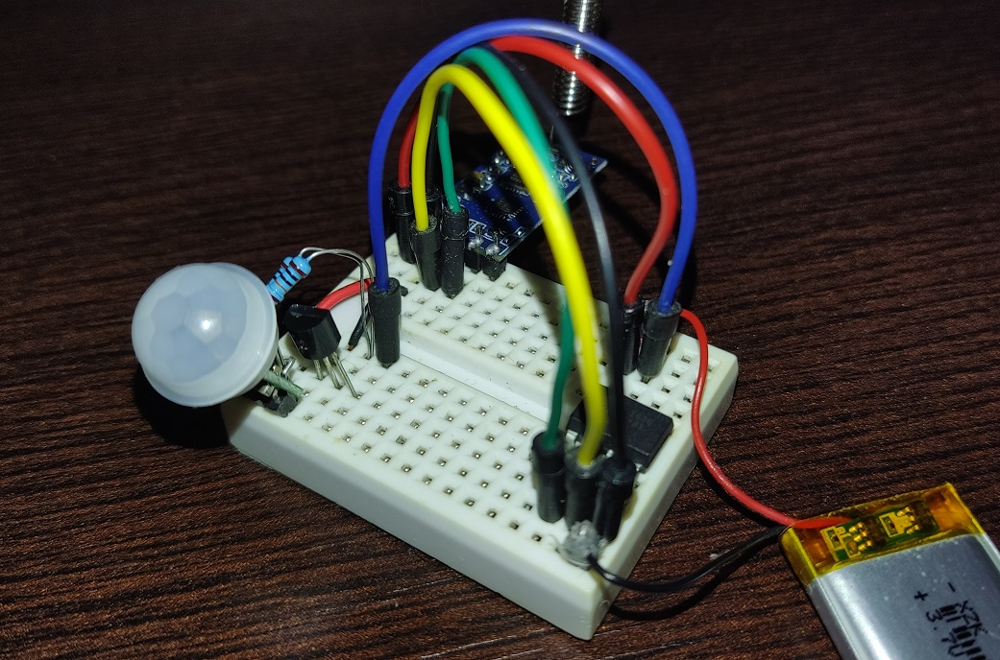

# Client Node: ATtiny85 & HC-12 as a transmitter

Low power client that sends short strings on an event: water detection, movement detection (PIR)...

## Test device

### Test button

### PIR sensor

## TODO
- [x] Test if device works with PIR sensor? Measure current consumption.
- [ ] Can ESP32 hub receive this client messages?
- [ ] Try to improve attiny_sender_sleep_chatgpt_and_me.cpp:
    - [ ] If HC-12 is diconnected, current wouldn't fluctuate from 0.01mA to 0.2mA (~3sec period). Check ChatGPTs response with title "Sleep interrupt with HC-12".
    - [ ] If signal is constantly HIGH/LOW (e.g. wires are in the water) device shouldn't keep sending alerts because it would drain battery fast. Device should sleep for some fixed amount of time after alert is sent.
- [ ] What fields should sent string contain: device ID (string), [alert ID so that main hub knows if it's the same alert that is reported e.g. 3 times for safety], ...
